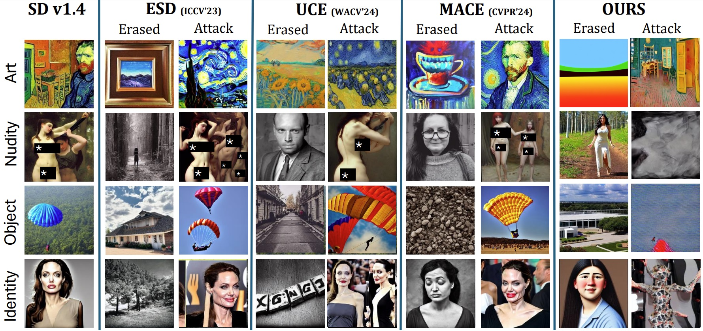
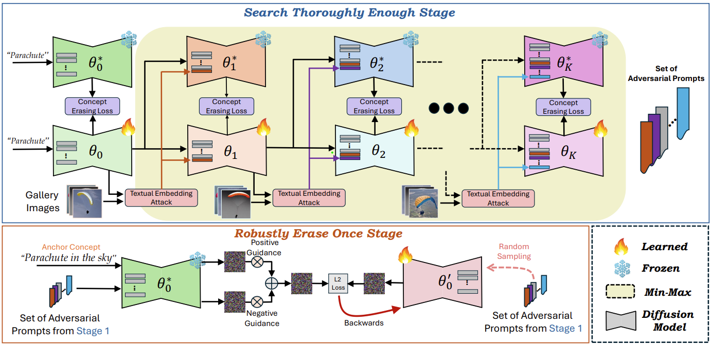

# ***STEREO***: Towards Adversarially Robust Concept Erasing from Text-to-Image Generation Models

<p align="center">
    
</p>

<p align="center">
  
</p>


> [**STEREO: Towards Adversarially Robust Concept Erasing from Text-to-Image Generation Models**]()<br>
> [Koushik Srivatsan](https://koushiksrivats.github.io/), [Fahad Shamshad](https://fahadshamshad.github.io/), [Muzammal Naseer](https://muzammal-naseer.com/), and [Karthik Nandakumar](https://scholar.google.com.pk/citations?user=2qx0RnEAAAAJ&hl=en)
>
> **Mohamed bin Zayed University of AI**
>
> []()
>
> ---
>
> # :rocket: Release
* **(August 28, 2024)**
  * Paper uploaded on arXiv.
 
## Abstract

> **<p align="justify">** The rapid proliferation of large-scale text-to-image generation (T2IG) models has led to concerns about their potential misuse in generating harmful content. Though many methods have been proposed for erasing undesired concepts from T2IG models, they only provide a  false sense of security, as recent works demonstrate that concept-erased models (CEMs) can be easily deceived to generate the erased concept through adversarial attacks. The problem of adversarially robust concept erasing without significant degradation to model  utility (ability to generate benign concepts) remains an unresolved challenge, especially in the white-box setting where the adversary has access to the CEM. To address this gap, we propose an approach called ***STEREO*** that involves two distinct stages. The first   stage **S**earches **T**horoughly **E**nough (**STE**) for strong and diverse adversarial prompts that can regenerate an erased concept from a CEM, by leveraging robust optimization principles from adversarial training. In the second **R**obustly **E**rase **O**nce (**REO**) stage, we introduce an anchor-concept-based compositional objective to robustly erase the target concept at one go, while attempting to minimize the degradation on model utility. By benchmarking the proposed ***STEREO*** approach against four state-of-the-art concept erasure methods under three adversarial attacks, we demonstrate its ability to achieve a better robustness vs. utility trade-off.
 
  ## Highlights
Large-scale diffusion models for text-to-image generation are susceptible to adversarial attacks that can regenerate harmful concepts despite erasure efforts. We introduce ***STEREO***, a robust approach designed to prevent this regeneration while preserving the model's ability to generate benign content.


<p align="center">
  
</p>

**<p align="justify">** ***Overview of STEREO***. Our novel two-stage approach robustly erases target concepts from pre-trained text-to-image generation models while preserving high utility for benign concepts. **Stage 1 (top)**: Search Thoroughly Enough finetunes the model through iterative concept erasing and concept inversion attacks, ensuring resilience against adversarial regeneration attempts. **Stage 2 (bottom)**: Robustly Erase Once fine-tunes the model using anchor concept and the set of strong adversarial prompts from Stage 1 via a compositional objective, maintaining high-fidelity generation of benign conceptswhile robustly erasing the target concept.
 


If you find our work and this repository useful, please consider giving our repo a star and citing our paper as follows:
```bibtex
@article{srivatsan2024stereo,
  title={STEREO: Towards Adversarially Robust Concept Erasing from Text-to-Image Generation Models},
  author={Koushik, Srivatsan and Shamshad, Fahad and Naseer, Muzammal and Nandakumar, Karthik},
  journal={arXiv preprint arXiv:xxxxxxx},
  year={2024}
}
```
## Contact
If you have any questions, please create an issue on this repository or contact at koushik.srivatsan@mbzuai.ac.ae.


## 🔜 Code and Models Coming Soon !!
