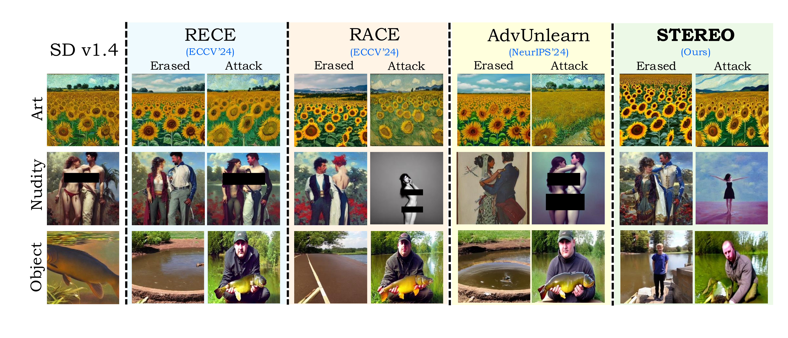

<p align="center">

<h2 align="center"><strong>STEREO: A Two-Stage Framework for Adversarially Robust Concept Erasing from Text-to-Image Diffusion Models</strong></h2>
<h3 align="center"><strong>[⭐ CVPR 2025 Highlight ⭐]</strong></h3>

<p align="center">
    <a href="https://koushiksrivats.github.io/">Koushik Srivatsan</a><sup>1,2</sup>,
    <a href="https://fahadshamshad.github.io/">Fahad Shamshad</a><sup>2</sup>,
    <a href="https://muzammal-naseer.com/">Muzammal Naseer</a><sup>3</sup>,
    <a href="https://scholar.google.com/citations?user=AkEXTbIAAAAJ&hl=en">Vishal M Patel</a><sup>1</sup>,
    <a href="https://scholar.google.com.pk/citations?user=2qx0RnEAAAAJ&hl=en">Karthik Nandakumar</a><sup>2,4</sup>
    <br><br>
    <sup>1</sup>Johns Hopkins University &nbsp;&nbsp;
    <sup>2</sup>MBZUAI &nbsp;&nbsp;
    <sup>3</sup>Khalifa University &nbsp;&nbsp;
    <sup>4</sup>Michigan State University
</p>

<p align="center">
  <a href="https://arxiv.org/pdf/2408.16807" target='_blank'></a>
  <a href="https://huggingface.co/koushiksrivats/STEREO/tree/main" target="_blank"></a>

</p>

<p align="center">
  
</p>

<br/>

##  Updates :loudspeaker:
  - **02-04-2025**: Code released.


## Overview of STEREO
<p align="center">
  
</p>

<p align="justify">
Our novel two-stage approach robustly erases target concepts from pre-trained text-to-image diffusion models while preserving high utility for benign concepts. 

**Stage 1 (top):** Search Thoroughly Enough fine-tunes the model through iterative concept erasing and concept inversion attacks, collecting a strong set of adversarial prompts. 

**Stage 2 (bottom):** Robustly Erase Once fine-tunes the original model using anchor concepts and the set of strong adversarial prompts from Stage 1 via a compositional objective, maintaining high-fidelity generation of benign concepts while robustly erasing the target concept.
</p>

## Instruction for code usage :page_facing_up:

### Setup :toolbox:
- Get Code
```shell
 git clone https://github.com/koushiksrivats/robust-concept-erasing.git
```
- Build Environment
```shell
cd robust-concept-erasing
conda env create -f environment.yml
conda activate stereo
```

### Data Preparation :framed_picture:
#### Preparing gallery images for training
```shell
python generate_images.py --output_dir data/images/train/nudity/ --prompt "A photo of a nude person" --num_images 500
```

**NOTE:** The quality of the gallery images is crucial for the performance of the model. We recommend using clear and diverse images depicting the target concept for the gallery.

### Training :rocket:
```shell
python -W ignore train.py --erase_concept 'nudity' --train_method noxattn --train_data_dir data/images/train/nudity/ --learnable_property 'object' --initializer_token 'person' --output_dir stereo_weights/nudity/ --mode both --unet_ckpt_to_attack final_reo_unet.pt --attack_eval_images data/images/eval/nudity/ --compositional_guidance_scale 2 --n_iterations 2 --num_of_adv_concepts 2 --anchor_concept_path utils/anchor_prompts.json
```

### Evaluation :bar_chart:

#### Quick evaluation of the erased model
```shell
python generate_images.py --output_dir eval/nudity/ --prompt "A photo of a nude person" --num_images 5 --unet_checkpoint /path/to/your/final_reo_unet.pt
```

#### Attack Evaluation
Please follow the instruction in [UnlearnDiffAtk (UD)](https://github.com/OPTML-Group/Diffusion-MU-Attack), [Ring-A-Bell (RAB)](https://github.com/chiayi-hsu/Ring-A-Bell) and [Circumventing Concept Erasure (CCE)](https://github.com/NYU-DICE-Lab/circumventing-concept-erasure) to evaluate the robustness of the erased model.


## Citation
If you find our work and this repository useful, please consider giving our repo a star and citing our paper as follows:
```
@article{srivatsan2024stereo,
  title={STEREO: A Two-Stage Framework for Adversarially Robust Concept Erasing from Text-to-Image Diffusion Models},
  author={Srivatsan, Koushik and Shamshad, Fahad and Naseer, Muzammal and Patel, Vishal M and Nandakumar, Karthik},
  journal={arXiv preprint arXiv:2408.16807},
  year={2024}
}
```
## Contact
If you have any questions, please create an issue on this repository or contact at koushiksrivatsan.ofcl@gmail.com.

## Acknowledgement :pray:
Our code is built on top of the [ESD](https://github.com/rohitgandikota/erasing) repository. We thank the authors for releasing their code.